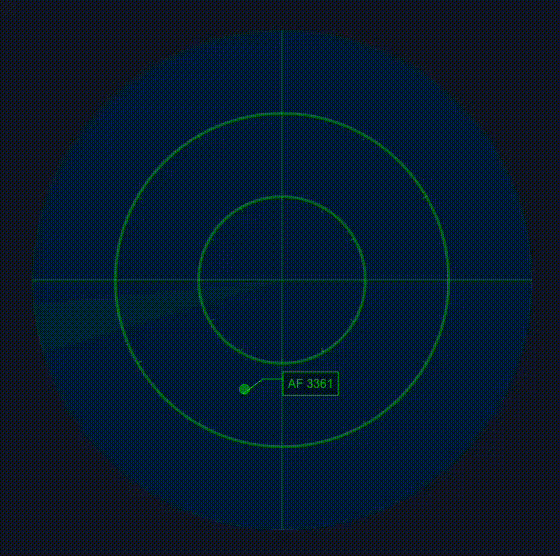

# Radar

POC (Proof of Concept) d'un radar d'aéroport développé avec React, TypeScript, et Pixi.js. Ce projet est une démonstration technique des capacités de Pixi.js intégré dans React pour simuler un affichage radar.

## 🎥 Démonstration



## 🚀 Démarrage

```bash
# Installation des dépendances
bun install

# Lancement de Storybook
bun storybook

# Storybook sera accessible sur :
# http://localhost:6006
```

## 🛠 Technologies

- Framework : React + TypeScript
- Rendu graphique : Pixi.js
- Styles : TailwindCSS + shadcn/ui
- Documentation : Storybook

## 🎯 Objectif du POC

Démontrer la faisabilité d'un radar aéroportuaire avec :
- Rendu performant via Pixi.js
- Animation fluide du balayage radar
- Simulation de cibles mobiles
- Interface réactive et moderne

## 🏗 Architecture

Le projet est organisé en :
- `src/components` : Composants React (notamment `AirportRadar`)
- `src/hooks` : Hooks personnalisés pour la logique radar
  - `usePixiApp` : Initialisation de Pixi.js
  - `useRadarCircles` : Gestion des cercles concentriques
  - `useRadarGrid` : Grille de référence
  - `useRadarSweep` : Animation du balayage
  - `useRadarTargets` : Gestion des cibles
  - `useTargetSimulator` : Simulation du mouvement des cibles
- `src/stories` : Documentation et démonstration via Storybook

## 🤝 Services Professionnels

### 🎯 Besoin de composants React ?

offroadLabs développe des composants React sur mesure. Si vous avez besoin d'un radar ou d'autres composants de visualisation pour votre application, nous pouvons les créer pour vous !

#### Services Proposés

* ✅ Développement de composants React sur mesure
* ✅ Intégration dans votre application React existante
* ✅ Optimisation des performances
* ✅ Support technique

#### Expertise Technique

* 🔧 React/TypeScript
* 🔧 Pixi.js pour le rendu graphique
* 🔧 Animations fluides et performantes
* 🔧 Intégration de données en temps réel

### 📈 Pourquoi nous faire confiance ?

* 💡 Expertise en composants React
* 💡 Approche pragmatique et orientée résultats
* 💡 Engagement qualité et bonnes pratiques
* 💡 Expérience concrète sur des projets similaires

### 📞 Contact

Pour discuter de vos besoins :

* 🗓️ Prendre rendez-vous : https://hub.timoner.com
* 📧 Email : sebastien@offroadlabs.com
* 🌐 Blog technique : timoner.com
* 🌐 Site web : offroadlabs.com
